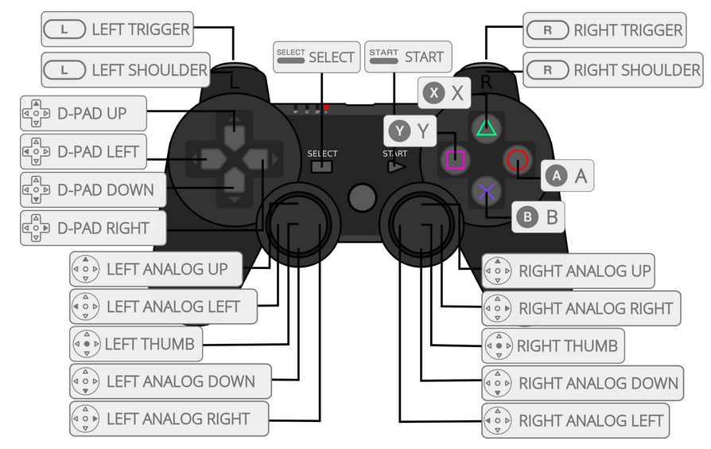

# 履带无人车实物实验支持包

## 功能
* 控制板指令发送与状态接收(待测试)
* 手柄遥控与键盘遥控(待测试)
* 动捕位姿反馈接收(待测试)

## 控制板指令发送与状态接收
### 底板发送（emb）:
1. 底盘状态反馈:
   
    在usb端点0x82

    * drift8 voltage;   //V
    * drift32 imuQuat[3];   //r,p,y
    * drift16 wheelSpeeds[2];   //rad/s
    * uint16_t armAngles[2];    //49~2000
    
    字节对齐，长度21字节

2. 调试信息:

    在usb端点0x84,按字符流发送。

### 底板发送（ros）: 话题名[uvs_emb_status](src/uvs_message/msg/UvEmbStatus.msg)

### 底板接收（emb）:
1. 速度角速度指令

    在usb端点0x02

    * drift16 linearVel;    // m/s
    * drift16 angularVel;   // rad/s

    字节对齐，长度4字节
2. 机械臂角度指令

    在usb端点0x04

    * uint8_t flag == 0;
    * uint16_t armAngles[2];    //49~2000

    字节对齐,长度5字节

3. 电磁铁开关指令

    在usb端点0x04
    * uint8_t flag == 1;
    * uint8_t emag; //1:open;0:close

    字节对齐，长度2字节

4. 舵机角度指令

    在usb端点0x04
    * uint8_t flag == 2;
    * uint16_t tripodAngle; //deg

    字节对齐，长度3字节

### 底板接收（ros）:
1. 速度角速度指令 话题名[uvs_emb_kinetics](src/uvs_message/msg/UvEmbKinetics.msg)
2. 机械臂角度指令 话题名[uvs_emb_arm](src/uvs_message/msg/UvEmbArm.msg)
3. 电磁铁开关指令 话题名[uvs_emb_emag](src/uvs_message/msg/UvEmbEmag.msg)
4. 舵机角度指令 未使用

## 手柄遥控与键盘遥控
### 手柄遥控

|键位|映射|备注|
|---|---|---|
|右手模拟摇杆UD|线速度|xid:4 U:-32767 D:32767|
|右手模拟摇杆RL|角速度|xid:3 L:-32767 R:32767|
|D-PAD UD|机械臂基座轴角度加减|xid:7 U:-32767 D:32767|
|X B|机械臂手臂轴角度加减|X(Y) bid:3    B(A) bid:0|
|Right Trigger|按下电磁铁使能|xid:5 Up:-32767 Down:32767|
|||
### 键盘遥控
|键位|映射|
|---|---|
|w|+线速度|
|s|-线速度|
|a|+角速度|
|d|-角速度|
|u|机械臂基座轴角度加|
|o|机械臂基座轴角度减|
|j|机械臂手臂轴角度加|
|l|机械臂手臂轴角度减|
|space|按下电磁铁使能|
|||
## 动捕位姿反馈接收
ros2参数: LocalIPv4Addr(本机IP地址) ServerIPv4Addr(动捕主机地址)两个参数均选填，如果未指定地址，则运行主机发现功能，会列出所有可能的主机，键入序号进行连接。
动捕信息 话题名[uvs_pose_list](src/uvs_message/msg/UvOptPoseList.msg)
